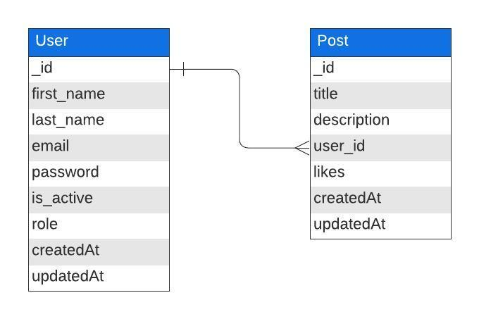

# Social Network Backend Project 


##  Table of Contents 📝

- [About the Project 📁](#about-the-project-📁)
- [Deploy 🚀](#deploy-🚀)
- [Stack](#stack-💻)
- [Database Diagram📋](#database-diagram-📋)
- [Local Installation Option ⚙️](#local-installation-option-⚙️)
- [Users created](#users-created🌐) 
- [Endpoints ⚙️](#endpoints-⚙️)
- [Future Functionalities 👨🏻‍💻](#future-functionalities-👨🏻‍💻)
- [Author ✒️](#author-✒️)
- [Thanks 🎓](#thanks-🎓)

 
## About the Project 📁

This platform recreates a fictitious database where users can register, log in, post, like posts and also differentiate themselves from them.


## Deploy 💫

Deploy via Zeabur: [redsocialmongo.zeabur.app](https://redsocialmongo.zeabur.app/) <br>
(This is a free version of Zeabur and can get suspended at any moment.)

## Stack 💻

<div align="center">
<a href="https://www.expressjs.com/">
    
</a>
<a href="https://nodejs.org/es/">
    
</a>
<a href="https://developer.mozilla.org/es/docs/Web/JavaScript">
    
</a>
<a href="https://www.mongodb.com/">
    
</a>
<a href="">
    
</a>
<a href="">
    
</a>
 </div>

## Database Diagram 📊

This diagram shows the structure of the database tables.



## How to Use ⚙️

### Local Installation Option

1. Clone the repository:

```sh
git clone https://github.com/tatisortiz/fdsProjectRedSocialMongo.git
```

2. Place yourself in the folder

```sh
cd Red_Social_Mongo
```

3. Install the dependencies:

```sh
npm install
```
4. Copy the file .env.example, </br>
   change the name to .env </br>
   and fill in all the fields

5. Plant the seeds into the tables

```sh
npm run db:seed
```

### Usage

To run the server:

```sh
npm run dev
```
## Users created 🌐
1. User - role: user
```json
{
  "first_name": "user",
  "last_name": "user",
  "email": "user@user.com",
  "password": "12345689",
  "role": "user",
}
```
2.  SuperAdmin - role: superadmin
```json
     {
                
     "first_name": "superadmin",
     "last_name": "superadmin",
     "email": "superadmin@superadmin.com",
     "password":"123456789",
     "role": "super_admin",
            },
```


## Endpoints ⚙️

<details>
<summary>Authentication</summary>

| Method |        URI         |            Action             |             Auth              |                                 Body                                  |
| :----: | :----------------: | :---------------------------: | :---------------------------: | :-------------------------------------------------------------------: |
|  POST  | /api/auth/register |      Register a new user      | <center>N/A (public)</center> | `{ "email": "email@email.com",`<br>`"password": "yourPassword" }` |
|  POST  |  /api/auth/login   | Login a user and return a JWT | <center>N/A (public)</center> | `{ "email": "email@email.com",`<br>`"password": "yourPassword" }` |

</details>

<details>
<summary>Users</summary>

| Method |          URI           |            Action            |             Auth              |                                                              Body                                                              |
| :----: | :--------------------: | :--------------------------: | :---------------------------: | :----------------------------------------------------------------------------------------------------------------------------: |
|  GET   |       /api/users       |        View all users        |     Token (isSuperAdmin)      |                                                      <center>N/A</center>                                                      |
|  GET   |   /api/users/profile   |  View your own user profile  |         Token (user)          |                                                      <center>N/A</center>                                                      |
|  GET   | /api/users/profile/:id | View user profile by user id | <center>N/A (public)</center> |                                                      <center>N/A</center>                                                      |
|  PUT   |   /api/users/profile   |     Update user profile      |         Token (user)          | `{ "first_name": "newFirstName",`<br>`"last_name": "newLastName",`<br>` "email": "newEmail",`<br>`"password": "newPassword" }` |

</details>

<details>
<summary>Posts</summary>

| Method |         URI          |             Action              |          Permissions          |                                 Body                                  |
| :----: | :------------------: | :-----------------------------: | :---------------------------: | :-------------------------------------------------------------------: |
|  POST  |      /api/posts      |           Create post           |         Token (user)          |    `{ "title": "postTitle",`<br>`"description": "postDescription" }`    |
| DELETE | /api/posts/admin/:id |     Delete post by post id      |     Token (isSuperAdmin)      |                         <center>N/A</center>                          |
| DELETE |    /api/posts/:id    | Delete your own post by post id |         Token (user)          |                         <center>N/A</center>                          |
|  PUT   | /api/posts/like/:id  |      Like post by post id       |         Token (user)          |                         <center>N/A</center>                          |
|  PUT   |    /api/posts/:id    | Update your own post by post id |         Token (user)          | `{ "title": "newPostTitle",`<br>`"description": "newPostDescription" }` |
|  GET   |    /api/posts/own    |       View your own posts       |         Token (user)          |                         <center>N/A</center>                          |
|  GET   |     /api/posts/      |         View all posts          | <center>N/A (public)</center> |                         <center>N/A</center>                          |
|  GET   | /api/posts/user/:id  |      View post by user id       | <center>N/A (public)</center> |                         <center>N/A</center>                          |
|  GET   |    /api/posts/:id    |      View post by post id       | <center>N/A (public)</center> |                         <center>N/A</center>                          |

</details>


## Future functionalities 👨🏻‍💻

- The option to follow and unfollow between users.
- A homescreen where you see all the post of the people you follow.
- Be able to chat with another user.

## Author ✒️

- Tatiana ortiz


## Thanks 🎓

Many thanks to the Geekshubs Academy for the opportunity to learn and grow as a developer, every day you get better.